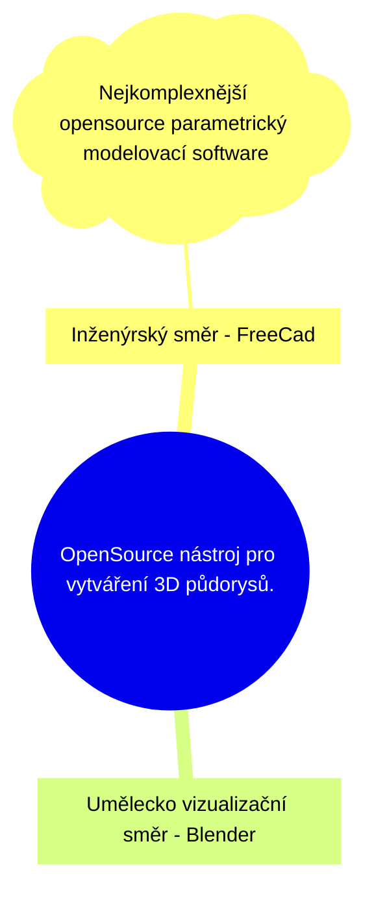

-- https://projects.fit.cvut.cz/theses/5898

**Název práce:**
Vývoj doplňku pro konceptuální architektonické navrhování v prostředí Blenderu

**Možné zadání:**
1. Proveďte rešerši existujících nástrojů pro architektonický koncepční návrh a porovnejte jejich klíčové vlastnosti
2. Analyzujte potřeby jednotlivých cílových skupin se zaměřením na přechod od 2D půdorysu k 3D modelu
3. Navrhněte uživatelské rozhraní a ovládání doplňku s důrazem na intuitivnost a rychlou iteraci návrhu
4. Implementujte doplňek v jazyce Python s využitím Blender API, který bude řešit problém vytváření 2D půdorysů a generování 3D dispozic
5. Ověrte funkčnost nástroje na modelovém příkladu - testování
6. Vyhoďnoťte efektivitu workflow ve vytvořeném doplňku ve srovnání se standardními postupy v Blenderu

