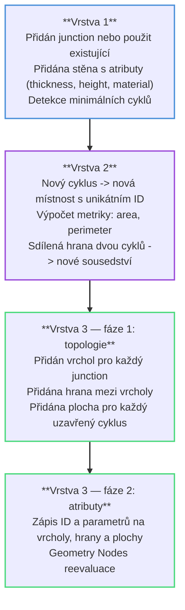
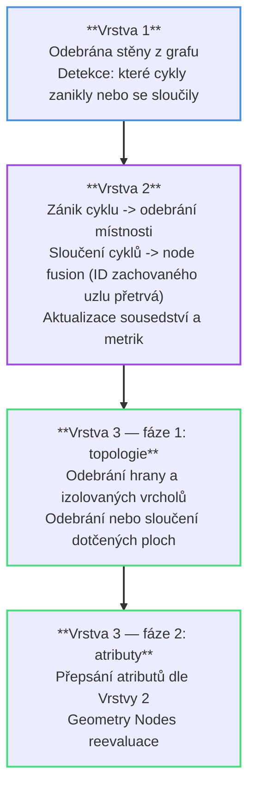
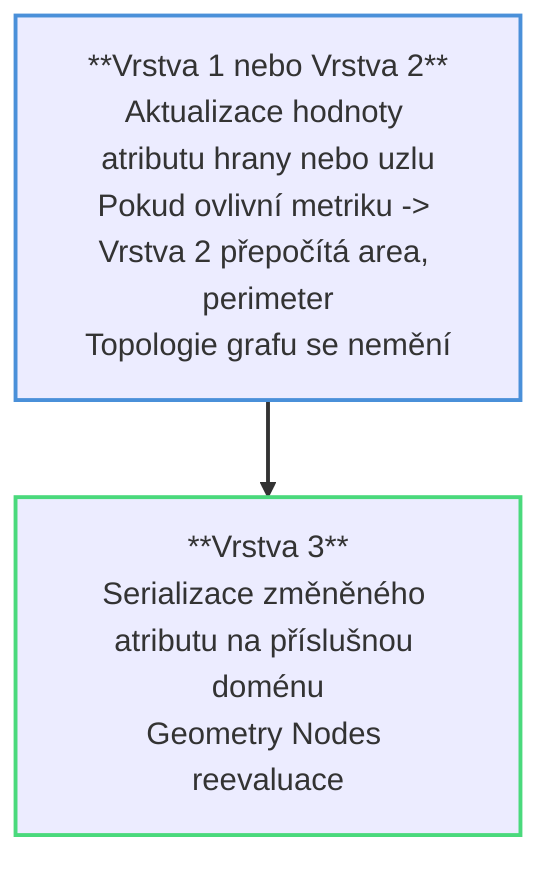

# Tok dat mezi vrstvami
Komunikace mezi vrstvami je striktně jednosměrná a hierarchická: změny vždy iniciuje Vrstva 1, která automaticky spouští reakci Vrstvy 2, a teprve po ustálení obou grafů se data serializují do Vrstvy 3. Zpětný tok (Vrstva 3 → Vrstva 2 nebo Vrstva 1) neexistuje — Blender mesh je vždy jen odrazem aktuálního stavu grafů, nikoliv jejich výchozím bodem.

## Přidání hrany (nová stěna)

## Odebrání hrany (smazání stěny)

## Změna atributu (parametrická úprava)

- nejlevnější operace v systému — nemění strukturu grafů, pouze číselné hodnoty
- ID místností a stěn zůstávají nezměněna, úprava je vždy nedestruktivní
