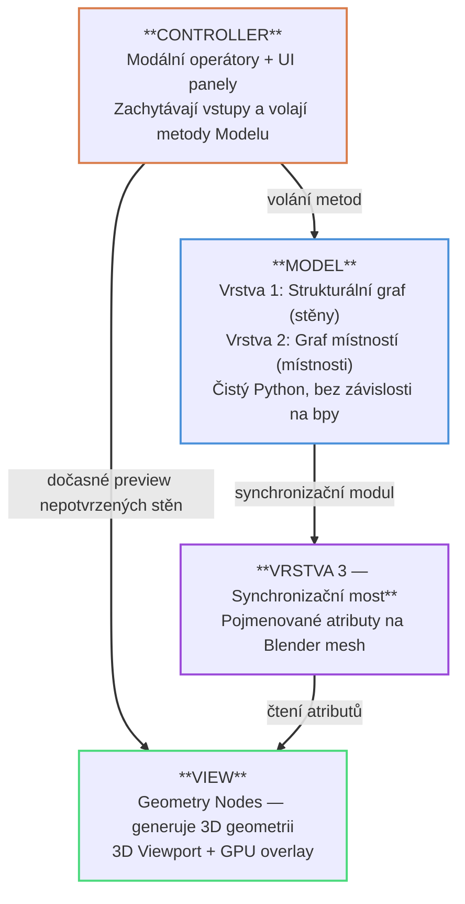

# 3.2 Architektura systému
Technická analýza (kapitola 2.6) identifikovala klíčové technologické volby pro realizaci addonu: Geometry Nodes jako výpočetní jádro pro generování 3D geometrie, strukturální graf a NRG pro datovou reprezentaci půdorysu, modální operátory pro interaktivní kreslení a pojmenované atributy jako synchronizační most mezi Pythonem a Blenderem. Tato sekce překládá analytické závěry do konkrétní softwarové architektury a poskytuje ucelený pohled z ptačí perspektivy — z jakých bloků se systém skládá (statika), jak tyto bloky komunikují (dynamika) a jakými pravidly se tato komunikace řídí.

Základem návrhu je třívrstvá hybridní architektura, která striktně odděluje matematickou logiku v Pythonu od vizualizace v Blenderu. Python addon vlastní veškerou logiku — topologii stěn, sémantiku místností i validaci parametrů. Blender slouží výhradně jako zobrazovací engine, který skrze Geometry Nodes čte data z pojmenovaných atributů a generuje 3D geometrii v reálném čase. Komunikace je jednosměrná: Python → Blender, nikdy naopak. Scope návrhu je omezen na jedno podlaží v souladu s definicí MVP (kapitola 3.1) — architektura je navržena tak, aby ji bylo v budoucnu možné rozšířit o hierarchii budov a pater.

## [Třívrstvá hybridní architektura](./02_architecture_layers.md)

## Vzor MVC v kontextu Blenderu
Architektura přirozeně odpovídá vzoru Model-View-Controller přizpůsobenému prostředí Blenderu:

- **Model** — vrstvy 1 a 2 jsou čistě Python grafové struktury bez závislosti na Blender API; obsahují veškerou logiku: topologii stěn, sémantiku místností, validaci parametrů
- **Vrstva 3 (most)** — pojmenované atributy uložené na Blender mesh; synchronizační modul do nich zapisuje výsledky Modelu, Geometry Nodes je čtou jako vstupy; jednosměrný a jednoúčelový datový channel
- **View** — Geometry Nodes modifikátor generuje 3D geometrii čtením atributů z vrstvy 3; GPU overlay vykresluje kreslicí náhled a HUD nezávisle na GN
- **Controller** — modální operátory zachytávají uživatelské vstupy a překládají je na volání metod Modelu; UI panely zobrazují a umožňují editaci parametrů

## [Dynamika systému](./02_architecture_data_flow.md)

## Principy návrhu
- **Oddělení zájmů** — grafová logika (Model) nezávisí na Blender API; lze ji testovat izolovaně jednotkovými testy
- **Nedestruktivní úpravy** — změna parametru nepřepisuje geometrii, ale vyvolá přegenerování skrze Geometry Nodes; uživatel se může kdykoli vrátit zpět nebo upravit libovolný parametr
- **Zpětná vazba v reálném čase** — každá změna v Modelu se okamžitě projeví ve View díky automatické reevaluaci Geometry Nodes modifikátoru
- **Modularita** — každý funkční požadavek (FP1–FP7) je realizován v samostatném Python modulu s jasně definovaným rozhraním
- **Konvence Blenderu** — addon dodržuje konvence pojmenování a registrace operátorů a panelů, integraci do nativního Undo/Redo systému a standardní strukturu addonu
