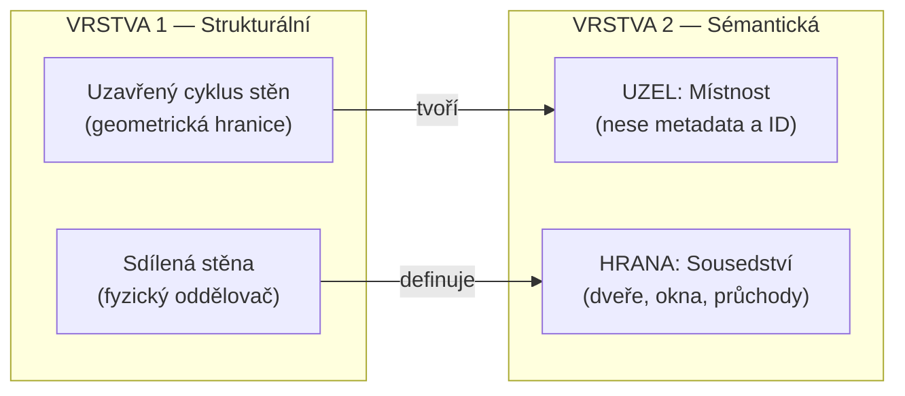

# 3.2 Datový model
Architektura (kapitola 3.1) definuje třívrstvou hybridní architekturu a tok dat mezi vrstvami. Tato sekce specifikuje konkrétní datové struktury, jejich atributy, operace a omezení — slouží jako exaktní „slovník" celého addonu. Definuje, jaká data systém spravuje, jaké mají typy a povolené rozsahy a jaké operace nad nimi existují.

Datový model operuje na úrovni jednoho podlaží. Vrstva 1 uchovává topologii stěn a propojovacích bodů, Vrstva 2 z ní odvozuje sémantiku místností a vztahů sousedství. Vrstva 3 přenáší data obou grafů do Blender mesh ve formě pojmenovaných atributů, kde je Geometry Nodes čtou a vizualizují.

## [Vrstva 1: Strukturální graf](./02_data_model_layer1.md)
## [Vrstva 2: Graf místností](./02_data_model_layer2.md)

## Vztah mezi vrstvami
Vrstva 1 a Vrstva 2 jsou úzce provázány asymetrickým vztahem: Vrstva 1 (topologie) diktuje tvar a existenci Vrstvy 2 (sémantika). Synchronizace je automatická a jednosměrná.

- přidání stěny do Vrstvy 1 → detekce nových cyklů → založení nové místnosti ve Vrstvě 2 s perzistentním ID
- odebrání stěny → zánik nebo sloučení cyklů → odebrání nebo sloučení místností
- posun propojovacího bodu → změna tvaru cyklu → přepočet plochy, obvodu a centroidu místnosti; ID a metadata zůstávají
- tloušťka stěny (Vrstva 1) → vstupní parametr pro 3D generování ve View; výška stěny → maximální výška místnosti
- materiál stěny (Vrstva 1) → slouží jako výchozí materiál vnitřního ohraničení místnosti ve Vrstvě 2

## Atributové schéma (Vrstva 3)
Pojmenované atributy na Blender mesh fungují jako datový bridge mezi Python grafy a Geometry Nodes. Každý atribut je vázán na konkrétní doménu mesh elementu (vertex, hrana, plocha). UUID identifikátory z Vrstev 1 a 2 se převádějí na celá čísla pro optimalizaci.

| Doména | Atribut | Typ | Výchozí | Účel | Aktualizace při |
| :--- | :--- | :--- | :--- | :--- | :--- |
| Vertex | `junction_id` | Integer | 0 | identifikace propojovacího bodu | vytvoření/smazání junctionu |
| Edge | `wall_id` | Integer | 0 | identifikace stěny | vytvoření/smazání stěny |
| Edge | `wall_thickness` | Float | 0.2 | tloušťka stěny (m) | změna parametru |
| Edge | `wall_height` | Float | 3.0 | výška stěny (m) | změna parametru |
| Edge | `wall_material_id` | Integer | 0 | index materiálu | změna materiálu |
| Face | `room_id` | Integer | 0 | identifikace místnosti | detekce/zánik cyklu |
| Face | `room_area` | Float | 0.0 | plocha místnosti ($m^2$) | změna geometrie |
| Face | `room_perimeter` | Float | 0.0 | obvod místnosti (m) | změna geometrie |
| Face | `room_type` | Integer | 0 | klasifikace místnosti | změna typu |
| Face | `floor_material_id` | Integer | 0 | index materiálu podlahy | změna materiálu |
| Face | `ceiling_material_id` | Integer | 0 | index materiálu stropu | změna materiálu |

- celoobjektová metadata se ukládají jako vlastnosti Blender objektu: systém měření, verze addonu, čítač verze struktury pro invalidaci cache

## Validační pravidla
Validace se aplikuje před zápisem dat do datových modelů. Zabraňuje vzniku degenerované geometrie, která by způsobila vizuální artefakty nebo selhání algoritmů.

- **Parametry stěny**:
    - tloušťka: $0{,}05 \leq t \leq 1{,}0$ m — příliš tenké stěny způsobují Z-fighting, příliš tlusté nemají architektonický smysl
    - výška: $1{,}0 \leq h \leq 10{,}0$ m
    - úhel napojení: $0° < \alpha \leq 180°$
- **Parametry místnosti**:
    - minimální plocha: $> 1{,}0\, m^2$ — menší prostory typicky indikují chybu v kreslení, ne reálnou místnost
    - poměr stran: $0{,}1 \leq \frac{šířka}{délka} \leq 10{,}0$ — filtruje topologický „šum" (úzké štěrbiny)
    - minimálně 3 vrcholy (trojúhelník)
- **Jednotky**: veškeré interní výpočty v Pythonu i serializovaná data ve Vrstvě 3 jsou vždy v metrech; převod jednotek se aplikuje výhradně na prezentační vrstvě (UI) při zobrazování uživateli a parsování vstupů
