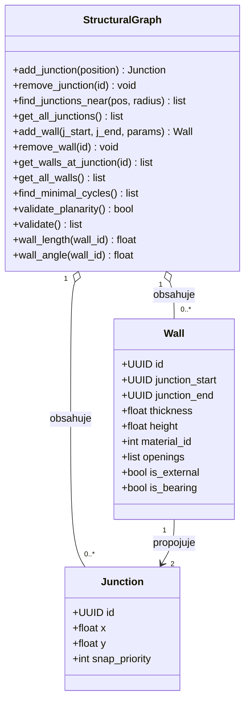

# Vrstva 1: Strukturální graf
Vrstva 1 je čistě matematická reprezentace půdorysu. Nemá ponětí o místnostech ani o 3D geometrii — vnímá prostor pouze jako množinu bodů spojených úsečkami v planárním 2D grafu. Na validitě a planaritě tohoto grafu závisí veškeré další výpočty, zejména detekce uzavřených prostorů ve Vrstvě 2 ([2.6 - Strukturální graf](../02_Analysis/06_ta_structural_graph.md)).

## Diagram tříd

Výchozí hodnoty: `thickness = 0.2` m, `height = 3.0` m.

## Omezení

### Propojovací bod (Junction)
- pozice musí být v rámci grafu unikátní (žádné duplicitní body na stejných souřadnicích)
- typ propojovacího bodu (roh, T-křižovatka, křížení) se odvozuje z počtu připojených hran

### Stěna (Wall)
- počáteční a koncový bod musí být různé (`junction_start` ≠ `junction_end`)
- mezi dvěma konkrétními body může vést maximálně jedna stěna (prostý graf)
- tloušťka a výška musí splňovat validační pravidla (viz [rodičovský soubor](./03_data_model.md))

## Operace strukturálního grafu
Graf zapouzdřuje veškerou manipulaci s topologií podlaží. Po každé změně garantuje, že graf zůstane validní. Operace jsou seskupeny do čtyř skupin:

- **Propojovací body (CRUD)**: přidání, odebrání, vyhledání v okolí (snapping), výčet všech bodů
- **Stěny (CRUD)**: přidání s parametry, odebrání, dotaz na stěny u daného bodu, výčet všech stěn
- **Analýza topologie**: detekce minimálních cyklů (klíčová operace pro Vrstvu 2), validace planarity, celková validace s výčtem chyb
- **Geometrické výpočty**: délka stěny, úhel stěny
