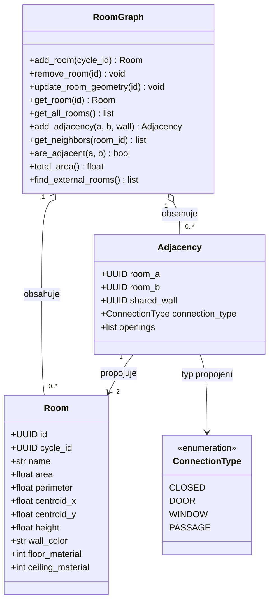

# Vrstva 2: Graf místností
Sémantická vrstva addonu, matematicky duální graf k Vrstvě 1. Dává topologickým tvarům architektonický význam — z uzavřených polygonů se stávají místnosti s identitou, názvem a vizuálními vlastnostmi. Vrstva je spravována primárně automaticky na základě detekovaných cyklů z Vrstvy 1 ([2.6 - NRG](../02_Analysis/06_ta_nrg.md), [2.6 - Hybridní spojení](../02_Analysis/06_ta_hybrid_connection.md)).

## Diagram tříd

## Omezení

### Místnost (Room)
- `id` je perzistentní — i když uživatel změní tvar místnosti k nepoznání, ID a sémantická metadata (název, materiály) přetrvávají, dokud nedojde k úplnému rozpojení cyklu
- `cycle_id` musí odkazovat na platný cyklus ve Vrstvě 1
- minimálně 3 hraniční vrcholy
- plocha a obvod musí splňovat validační pravidla (viz [rodičovský soubor](./03_data_model.md))

### Sousedství (Adjacency)
- sousedství vzniká automaticky při detekci sdílené stěny mezi dvěma cykly
- jedna dvojice místností může sdílet nejvýše jednu hranu sousedství (prostý graf místností)
