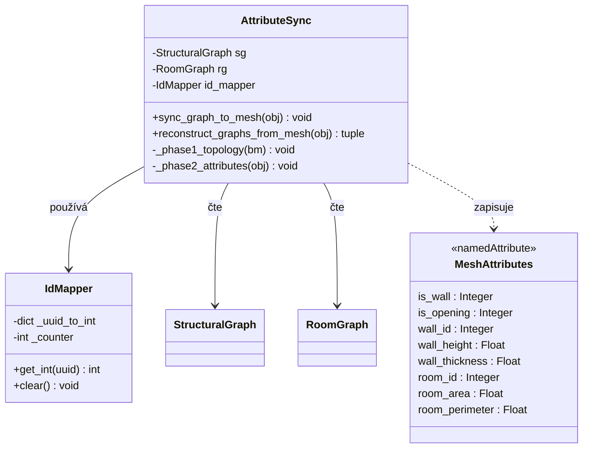

# Vrstva 3: Atributový bridge
Pojmenované atributy na Blender mesh fungují jako datový bridge mezi Python grafy a Geometry Nodes. Všechny atributy jsou vázány na doménu ploch (Face). Každá stěna je v base mesh reprezentována jako quad polygon — 2D obrys stěny s geometricky správnými rohy vypočítanými z tlouštěk sousedních stěn v každém junctionu. Geometry Nodes čtou atributy ploch a extrudují stěnové plochy do výšky. Tato strategie eliminuje potřebu edge-level atributů a umožňuje GN generovat správné rohové spoje bez další logiky. UUID identifikátory z Vrstev 1 a 2 se převádějí na celá čísla pro optimalizaci.

## Diagram tříd

## Atributové schéma

| Doména | Atribut | Typ | Výchozí | Účel | Aktualizace při |
| :--- | :--- | :--- | :--- | :--- | :--- |
| Face | `is_wall` | Integer | 0 | 1 = stěnová plocha, 0 = podlaha místnosti nebo otvor | každá sync |
| Face | `is_opening` | Integer | 0 | 1 = plocha cutterového tělesa otvoru (dveře, okno) | přidání/smazání otvoru |
| Face | `wall_id` | Integer | 0 | identifikace stěny | vytvoření/smazání stěny |
| Face | `wall_height` | Float | 3.0 | výška stěny pro extrozi (m) | změna parametru |
| Face | `wall_thickness` | Float | 0.2 | tloušťka stěny (m) | změna parametru |
| Face | `room_id` | Integer | 0 | identifikace místnosti | detekce/zánik cyklu |
| Face | `room_area` | Float | 0.0 | plocha místnosti ($m^2$) | změna geometrie |
| Face | `room_perimeter` | Float | 0.0 | obvod místnosti (m) | změna geometrie |

- celoobjektová metadata se ukládají jako vlastnosti Blender objektu: systém měření, verze addonu, čítač verze struktury pro invalidaci cache
- **projektová nastavení addonu** (výchozí tloušťka stěny, výchozí výška, hustota mřížky, systém jednotek, velikost textu kót) jsou uložena jako `Scene PropertyGroup` — jsou součástí `.blend` souboru, takže každý projekt má nezávislé hodnoty; výchozí hodnoty jsou zakódovány v definici PropertyGroup a nepotřebují `AddonPreferences` (viz [technická analýza persistence nastavení](../02_Analysis/06_ta_addon_preferences.md))
