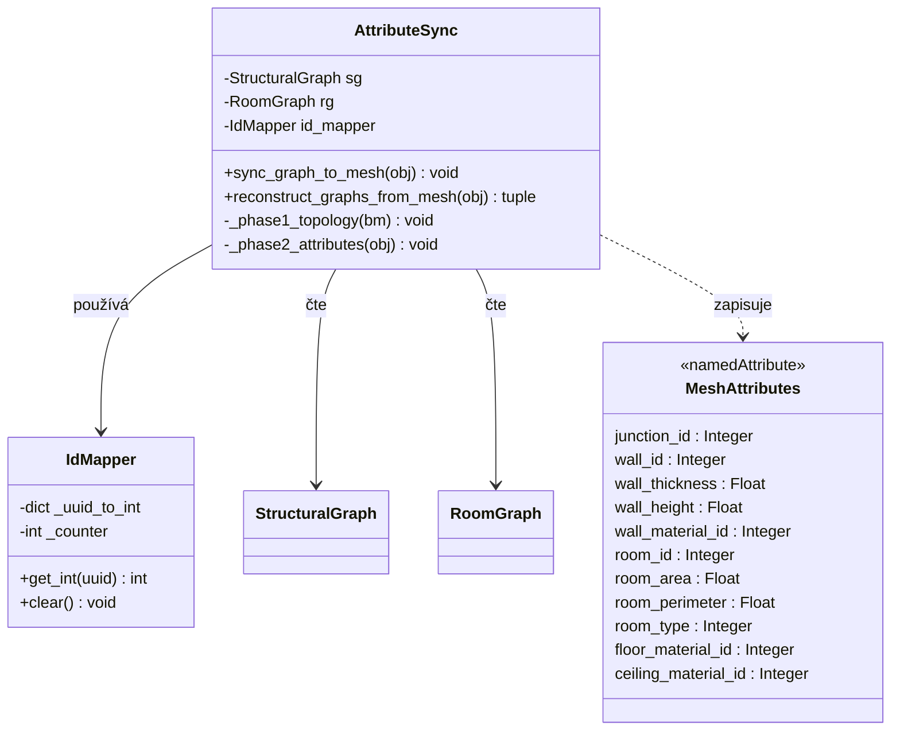

# Vrstva 3: Atributový bridge
Pojmenované atributy na Blender mesh fungují jako datový bridge mezi Python grafy a Geometry Nodes. Každý atribut je vázán na konkrétní doménu mesh elementu (vertex, hrana, plocha). UUID identifikátory z Vrstev 1 a 2 se převádějí na celá čísla pro optimalizaci.

## Diagram tříd

## Atributové schéma

| Doména | Atribut | Typ | Výchozí | Účel | Aktualizace při |
| :--- | :--- | :--- | :--- | :--- | :--- |
| Vertex | `junction_id` | Integer | 0 | identifikace propojovacího bodu | vytvoření/smazání junctionu |
| Edge | `wall_id` | Integer | 0 | identifikace stěny | vytvoření/smazání stěny |
| Edge | `wall_thickness` | Float | 0.2 | tloušťka stěny (m) | změna parametru |
| Edge | `wall_height` | Float | 3.0 | výška stěny (m) | změna parametru |
| Edge | `wall_material_id` | Integer | 0 | index materiálu | změna materiálu |
| Face | `room_id` | Integer | 0 | identifikace místnosti | detekce/zánik cyklu |
| Face | `room_area` | Float | 0.0 | plocha místnosti ($m^2$) | změna geometrie |
| Face | `room_perimeter` | Float | 0.0 | obvod místnosti (m) | změna geometrie |
| Face | `room_type` | Integer | 0 | klasifikace místnosti | změna typu |
| Face | `floor_material_id` | Integer | 0 | index materiálu podlahy | změna materiálu |
| Face | `ceiling_material_id` | Integer | 0 | index materiálu stropu | změna materiálu |

- celoobjektová metadata se ukládají jako vlastnosti Blender objektu: systém měření, verze addonu, čítač verze struktury pro invalidaci cache
- **projektová nastavení addonu** (výchozí tloušťka stěny, výchozí výška, hustota mřížky, systém jednotek, velikost textu kót) jsou uložena jako `Scene PropertyGroup` — jsou součástí `.blend` souboru, takže každý projekt má nezávislé hodnoty; výchozí hodnoty jsou zakódovány v definici PropertyGroup a nepotřebují `AddonPreferences` (viz [technická analýza persistence nastavení](../02_Analysis/06_ta_addon_preferences.md))
