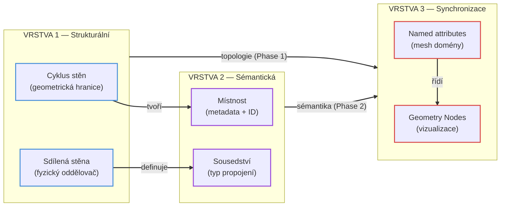
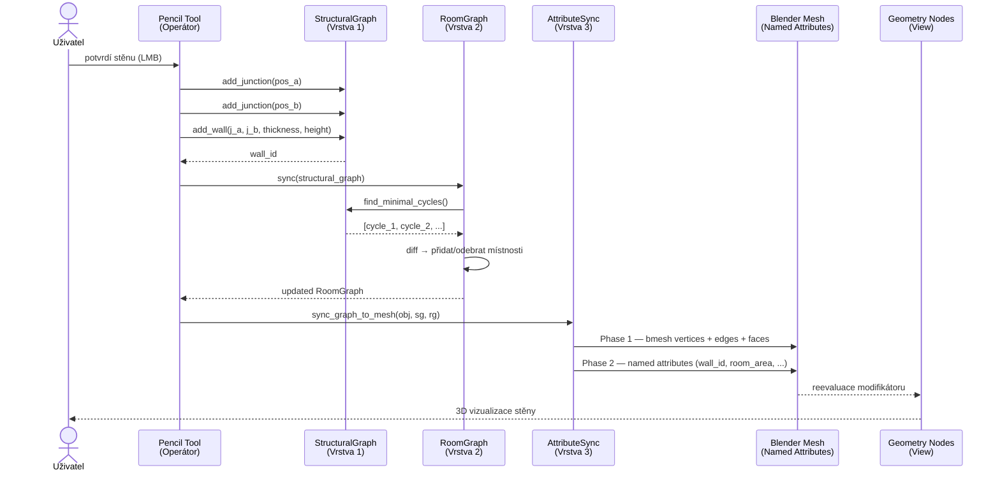

# Vztah mezi vrstvami
Všechny tři vrstvy jsou provázány jednosměrným asymetrickým tokem dat: Vrstva 1 (topologie) diktuje obsah Vrstvy 2 (sémantika), a obě společně zásobují Vrstvu 3 (synchronizace), která přenáší data do Blender mesh a spouští Geometry Nodes vizualizaci. Zpětný tok neexistuje.

## Statický pohled — závislosti tříd

## Dynamický pohled — sekvenční diagram

Klíčové vzory chování:
- přidání stěny do Vrstvy 1 → detekce nových cyklů → založení nové místnosti ve Vrstvě 2 s perzistentním ID
- odebrání stěny → zánik nebo sloučení cyklů → odebrání nebo sloučení místností
- posun propojovacího bodu → změna tvaru cyklu → přepočet plochy, obvodu a centroidu; ID a metadata zůstávají
- tloušťka a výška stěny (Vrstva 1) → vstupní parametry pro Geometry Nodes přes named attributes (Vrstva 3)
