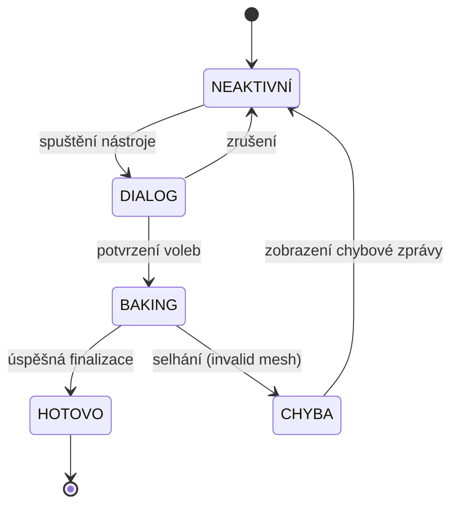

# FP4 — Finalizační nástroj
Nástroj Finalizace provede nevratný převod parametrického modelu (grafy + Geometry Nodes) do statické polygonové sítě vhodné pro export, UV mapování nebo herní engine. Jde o jednosměrnou operaci — po finalizaci nelze parametricky upravovat původní datový model. Proto addon před zahájením vygeneruje krok Undo jako záchranný bod.

## Stavový automat

## Možnosti finalizace

Uživatel před zahájením zvolí v dialogu:

| Volba | Popis |
| :--- | :--- |
| **Organizace výstupu** | Celý půdorys jako jeden objekt / samostatné objekty per místnost / separace stěny + podlahy + stropy |
| **Přiřazení materiálů** | Automaticky z metadat Vrstvy 2 (`floor_material_id`, `wall_material_id`) nebo ponechat výchozí Blender materiál |
| **Čistění atributů** | Odstranit pojmenované atributy z výsledné sítě (úspora dat pro export) |
| **Zachovat originál** | Duplikovat a finalizovat kopii vs. finalizovat přímo (destruktivní) |

## Interakce s datovým modelem

Pokud je zvolena možnost „zachovat originál", finalizace **nesmí** modifikovat Vrstvy 1 ani 2:

1. Aplikace GN modifikátoru → statická mesh vznikne z aktuálního stavu pojmenovaných atributů a GN stromu
2. Přiřazení materiálů dle `material_id` atributů z Vrstvy 3
3. Volitelné odstranění pojmenovaných atributů z výsledné sítě
4. Generování kroku Undo (záchranný bod před nevratnou operací)
