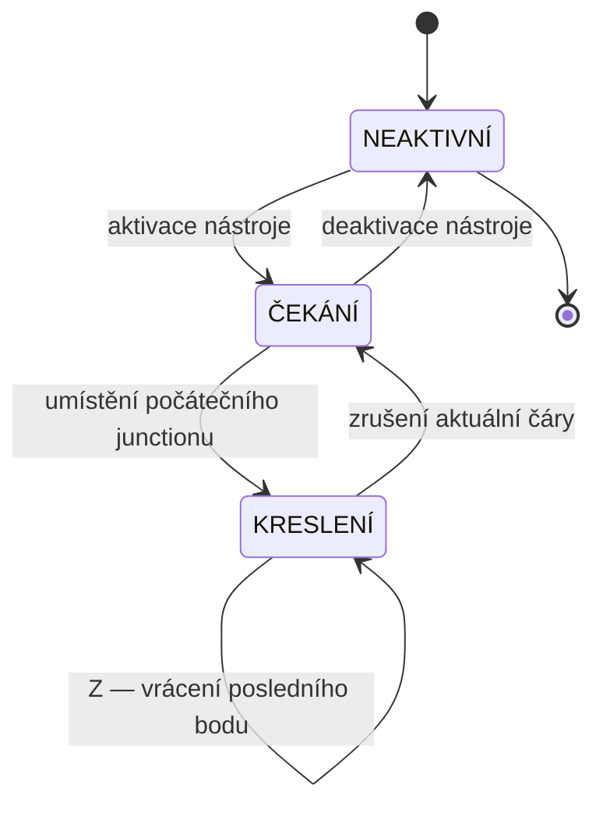

# FP1 — Interaktivní kreslení (Pencil Tool)
Nástroj Tužka je primární vstupní rozhraní addonu — modální operátor (Controller), který zachytává vstupy z myši a klávesnice a překládá je na operace nad Vrstvou 1 strukturálního grafu. Veškerá logika kreslení probíhá v 2D rovině (XY), Z-souřadnice je ignorována. Vizuální náhled (préview stěny, HUD s délkou a úhlem) kreslí GPU overlay nezávisle na datovém modelu — zápis do Vrstvy 1 nastane až po potvrzení bodu uživatelem, ne průběžně.

## Stavový automat

Operátor je řízen striktním stavovým automatem, který garantuje, že stěna nikdy nevznikne bez platného počátečního bodu a že nelze skončit v nekonzistentním stavu (např. při vícenásobném stisku ESC).

- **NEAKTIVNÍ** — nástroj je registrován, ale nepřijímá vstupy; jiné nástroje Blenderu fungují normálně
- **ČEKÁNÍ** — nástroj aktivní, kurzor sleduje myš, žádný počáteční bod není umístěn; GPU overlay zobrazuje mřížku a snap indikátory
- **KRESLENÍ** — první junction umístěn; GPU overlay kreslí náhled stěny od počátečního bodu ke kurzoru v reálném čase; HUD zobrazuje délku a úhel

## Snapping *(must-have / should-have)*

Snapping je výpočet provedený nad pozicí kurzoru před každým zápisem do Vrstvy 1. Priorita od nejvyšší:
1. **Snap na existující junction** *(must-have)* — pokud je kurzor do 15 pixelů od existujícího junctionu ve Vrstvě 1, přichytí se na jeho přesné souřadnice
2. **Snap na osu** *(should-have)* — pokud je odchylka kurzoru od osy X nebo Y menší než 10 pixelů relativně k poslednímu junctionu, souřadnice se zarovná na přímku
3. **Snap na mřížku** *(should-have)* — volitelné zarovnání na konfigurovaný rastr (0.1 m, 0.5 m, 1.0 m)
4. **Snap na úhel** *(should-have)* — zarovnání na násobky 45°

Aktivní snap se vizuálně indikuje kruhem u kurzoru. Uživatel může snap dočasně potlačit podržením Shift.

## Interakce s datovým modelem

Zápis do Vrstvy 1 nastane vždy až po potvrzení, nikdy průběžně při pohybu myši:

- **Potvrzení bodu** → `L1.add_junction(x, y)` nebo reuse existujícího junctionu v toleranci → vrátí `junction_id`
- **Potvrzení stěny** → `L1.add_wall(j_start, j_end, thickness, height, material)` → spustí detekci cyklů → Vrstva 2 aktualizuje místnosti → Vrstva 3 synchronizační cyklus (fáze 1 + fáze 2)
- **Vrácení** → `L1.remove_wall(last_wall_id)` + odstranění osiřelých junctionů → L2 + L3 sync
- **Zrušení** → žádný zápis do dat; GPU overlay se vypne

## Vizuální zpětná vazba (GPU overlay) *(nice-to-have)*

Veškeré kreslení préview probíhá v GPU draw_handler registrovaném na 3D Viewport — neukládá se do geometrie ani datového modelu:

- náhled stěny: čára od posledního junctionu ke kurzoru; odlišná barva od potvrzených stěn
- HUD: délka navrhované stěny a úhel k poslednímu úseku (aktualizováno při každém pohybu myši); ve stavu ČEKÁNÍ zobrazuje zprávu „Waiting for input"
- snap indikátor: barevný kruh u kurzoru při aktivním snapu
- nápověda kláves: ikony kláves a myši zobrazené v dolní stavové liště Blenderu (STATUSBAR_HT_header); stav ČEKÁNÍ zobrazuje LMB / Z / ESC; stav KRESLENÍ zobrazuje aktualizovanou sadu; HUD nápovědu kláves nezobrazuje
