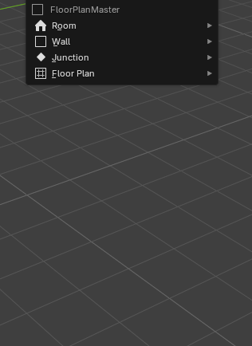
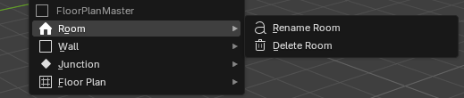
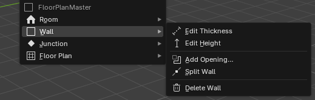
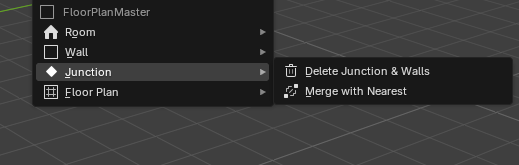
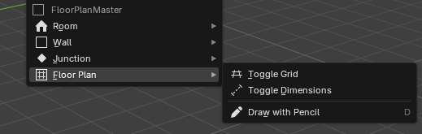

# 3.5.5 Kontextová nabídka

Kontextová nabídka poskytuje rychlý přístup k akcím, jejichž frekvence je nižší než základní kreslicí workflow (přejmenování, smazání, přidání otvoru, změna materiálu), aniž by tyto akce zahlcovaly N-panel nebo vyžadovaly zvláštní klávesové zkratky. Vyvolává se pravým tlačítkem myši (`RMB`) ve 3D Viewportu — Blender primární konvence pro kontextová menu, zavedená od verze 2.80 a konzistentně používaná napříč všemi nativními nástroji i Archipack. Přemapování RMB na jinou klávesu by narušilo svalovou paměť uživatelů, proto není zvažováno.

Klíčovým mechanismem kontextové nabídky je raycast — addon vrhne paprsek z pozice kurzoru do scény a přes Vrstvu 3 (Blender mesh s pojmenovanými atributy) identifikuje, na jaký typ elementu uživatel klikl. Mechanismus raycastu je popsán v [návrhu FP5](./04_features_fp5.md).

## Kontext nabídky a dostupné akce

Obsah nabídky se dynamicky mění podle výsledku raycastu. Tato kontextová citlivost redukuje vizuální šum — uživatel v každém kontextu vidí pouze akce relevantní pro daný prvek, nikoliv kompletní seznam všech operátorů addonu. Vzor je přejat z Archipack (RMB na objekt zobrazuje akce specifické pro typ architektonického prvku) a AutoCADu (RMB = kontextová nabídka závislá na výběru).

**Kontextová nabídka vyvolána pravým tlačítkem:**  

**Kontext: místnost** (klik na plochu uzavřeného cyklu Vrstvy 2)
- Přejmenovat místnost — otevře inline textové pole pro editaci `room_name`
- Smazat místnost — odstraní všechny ohraničující stěny z Vrstvy 1; spustí kaskádový zánik cyklu ve Vrstvě 2 a synchronizaci Vrstvy 3

**Kontext: stěna** (klik na hranu Vrstvy 1 promítnutou přes Vrstvu 3)
- Upravit tloušťku — inline číselné pole pro `wall_thickness`
- Upravit výšku — inline číselné pole pro `wall_height`
- Přidat otvor — dveře nebo okno (FP2 — should-have); otevře pop-over s parametry otvoru a umístěním na hraně
- Rozdělit stěnu — vloží nový junction na hranu Vrstvy 1 v místě kliknutí
- Smazat stěnu — odstraní hranu z Vrstvy 1 a spustí L2 + L3 synchronizaci

**Kontext: junction** (klik na vrchol Vrstvy 1)
- Smazat junction a přilehlé stěny
- Sloučit s nejbližším junctionem — merge v toleranci (FP1 mechanismus snapu)

**Kontext: prázdný prostor** (raycast nenajde žádný element)
- Zobrazit / skrýt mřížku
- Zobrazit / skrýt kótování (přepíná FP7 drag_handler)
- Nakreslit tužkou — alternativa k `D`, pro uživatele preferující RMB menu před klávesovými zkratkami

## Pop-over dialogy

Pro operace vyžadující textový vstup nebo výběr z enumu se nad kontextovou nabídkou zobrazí pop-over dialog u pozice kurzoru. Vzor odpovídá [analýze UI vzorů — Pop-over dialog pro detailní parametry](../02_Analysis/06_ta_ui_patterns.md): pop-over se otevírá u kurzoru, zobrazuje pouze parametry relevantní pro daný typ prvku a zavírá se kliknutím mimo — bez nutnosti `OK / Zrušit` pro čtecí operace. Blender nativně používá shodný vzor pro F9 (Last Operator pop-over).

Pole pouze pro čtení (plocha místnosti, obvod) jsou zobrazena jako neupravitelný text bez editačního pole — uživatel je okamžitě rozezná od editovatelných hodnot.

Dialog finalizace (FP4) je jedním z těchto pop-overů: zobrazuje volby organizace výstupu, přiřazení materiálů a opci zachování originálu, jak je specifikováno v [návrhu FP4](./04_features_fp4.md). Spouští se jak z kontextové nabídky (prázdný prostor nebo vybraná místnost), tak z tlačítka Finalizovat v N-panelu — jde o tutéž akci dostupnou ze dvou míst pro větší dostupnost.
