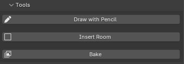
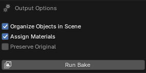
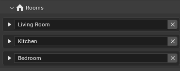
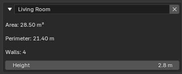
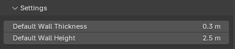
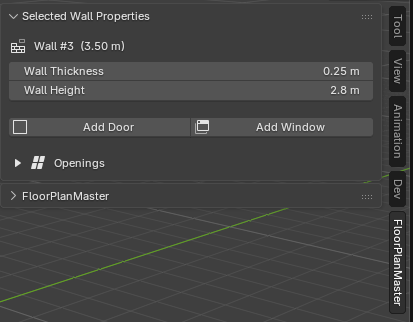
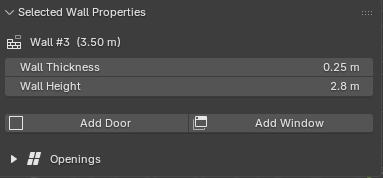
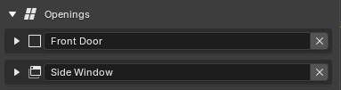
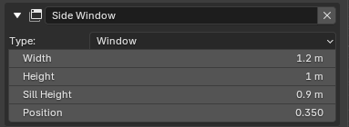

# 3.5.2 N-panel (Sidebar)

N-panel (Sidebar) ve 3D Viewportu je standardní místem, kam Blender addony umísťují trvalé parametrické rozhraní. Addon přidává záložku s názvem **FloorPlanMaster**, která sdružuje všechny ovládací prvky do jednoho přehledného místa dostupného stiskem `N`. Záložka je rozdělena do tří skládacích sekcí odpovídajících odlišným účelům: spouštění akcí (Nástroje), prohlížení a editace existujících prvků (Místnosti) a konfigurace globálních parametrů scény (Nastavení). Toto členění přejímá vzor z Archipack, kde je panel rovněž rozdělen na sekci operátorů a sekci parametrů vybraného objektu — při výběru prvku se jeho parametry automaticky zobrazí v příslušné části panelu bez nutnosti klikání na tlačítko Properties.

## Sekce Nástroje

Sekce Nástroje obsahuje tlačítka operátorů — akce, které vždy pracují s 3D kurzorem nebo spouštějí modální smyčku, nikoli s výběrem stávajících prvků. Toto odlišení je záměrné: Blender konvencí je, že akce modifikující výběr patří do jiných sekcí nebo kontextové nabídky, zatímco akce vkládající nové prvky jsou dostupné nezávisle na výběru.

Sekce obsahuje:

- **Nástroj tužka(Pencil Tool)** — alternativa ke klávesové zkratce `D`; aktivuje Pencil Tool (FP1) a přepne kurzor do aktivního stavu; identická akce jako klik na ikonu v Toolbaru
- **Vložit místnost(Insert Room)** — vloží pravoúhlou místnost se středem v pozici 3D kurzoru (FP2); výhodou oproti klávesové zkratce je, že uživatel vidí výchozí hodnoty a může je přepsat bez nutnosti pamatovat si přesnou klávesovou sekvenci; možnost upravit parametry místnosti později v rámci redo panelu v levém dolním rohu - nativní konvence Blenderu
- **Zapéct(Bake)** — spustí finalizační pipeline (FP4); zobrazí pop-over dialog s volbami výstupu (organizace objektů ve scéně, přiřazení materiálů, zachování originálu)

## Sekce Místnosti

Sekce Místnosti je hlavním přehledem datového modelu — seznam všech uzlů Vrstvy 2 (RoomGraph) se základními metrikami. Vzor odpovídá technice „list panel s automatickým výběrem", kterou používá Blender nativně v Object Data Properties pro vertex groups nebo shape keys: kliknutí na položku v seznamu synchronně vybere odpovídající prvek ve viewportu.

**Seznam místností** zobrazuje pro každou místnost:
- název místnosti (`room_name`) editovatelný přímo v řádku seznamu
- plochu v nastaveném systému jednotek (aktualizuje se automaticky při každé změně Vrstvy 1)

Kliknutím na položku v seznamu dojde k:
1. výběru místnosti ve viewportu (Vrstva 3 — plochy odpovídající danému cyklu jsou označeny)
2. zobrazení gizmos pro vybranou místnost (FP6 — tloušťka a výška přilehlých stěn)
3. rozbalení detailního pohledu přímo pod položkou v panelu

**Detailní pohled vybrané místnosti** zobrazuje pod vybranou položkou:
- editovatelný název místnosti a její výška(zobrazená výška je zde maximum ze stěn místnosti)
- obvod místnosti a počet stěn (pouze pro čtení)

**Sekce místností:**  
  
**Detail rozbalené místnosti:**  

## Sekce Nastavení

Sekce Nastavení obsahuje globální parametry scény uložené v `Scene PropertyGroup` (soulad s pravidlem persistence nastavení z kapitoly 3.1). Tyto parametry se aplikují na nově vytvářené prvky; existující prvky se nemodifikují, aby uživatel nepřišel o záměrně nastavené hodnoty.

| Parametr | Výchozí hodnota | Popis |
| :--- | :--- | :--- |
| Systém jednotek | Metrický | Přepíná zobrazení rozměrů v kótování i panelu; hodnoty jsou interně vždy v metrech |
| Výchozí tloušťka stěny | 0,3 m | Přednabídnuto při každém novém kreslení nebo vkládání místnosti |
| Výchozí výška stěny | 2,5 m | Přednabídnuto pro nové stěny |

Záměrně jsou do Nastavení zařazeny pouze parametry ovlivňující chování celého projektu, nikoliv parametry jednotlivých prvků — ty patří do detailního pohledu místnosti nebo jsou dostupné přes gizmos.

## Sekce aktuálně zvolené stěny

Tato sekce je oddělena od zbytku N panelu a nachází se na samotném vršku. Specifikace této sekce je, že se zobrazuje pouze pokud je uživatelem stěna zvolena v rámci scény. Tato sekce je při této akci automaticky otevřena a nabízí uživateli pohled na detail aktuální stěny a jejích otvorů.

Sekce je záměrně na vršku všech sekcí z jednoho prostého důvodu, když je aktivní, je to ta oblast zájmu, která uživatele v tu chvíli zajímá, co nejvíce. Jelikož je tato sekce neviditelná, jestliže stěna zvolená není, nijak nepřekaží. 

**Detail stěny uživateli nabízí:**
- vidět délku stěny(pouze pro čtění)
- manipulovat a měnit tloušťku a výšku stěny
- přidávat otvory pro danou stěnu

**Detail otvoru uživateli nabídí:**
- přejmenovat otvor na libovolný název
- změnit typ otvoru(dveře/okno)
- změnit parametry otvoru jako jsou šířka, výška, pro okna výška parapetu, a pozice v rámci šířky stěny

Otvory lze libovolně odebírat pomocí viditelného tlačítka X v rámci listu otvorů.

**Sekce aktuálně vybrané stěny ve scéně:**  

