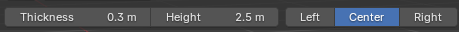
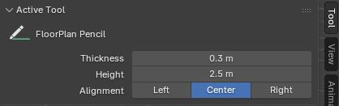

# 3.5.1 Toolbar — umístění nástroje Tužka

Toolbar (T-panel) je levý svislý panel ve 3D Viewportu, kde Blender soustřeďuje veškeré modální nástroje vyžadující trvalé zachytávání vstupu myši a klávesnice. Patří sem například Knife Tool, Loop Cut, Poly Build nebo Draw. Addon registruje Pencil Tool (FP1) jako WorkspaceTool — Blender jej tak automaticky zobrazí jako ikonové tlačítko v Toolbaru po instalaci addonu, bez nutnosti ručního přidávání do libovolného menu.

## Zdůvodnění umístění

Konvencí Blenderu je, že nástroj ovládaný levým tlačítkem myši a pracující v kontinuálním modálním režimu patří do Toolbaru. Pencil Tool splňuje oba kritéria: po aktivaci přebírá veškeré vstupy myši a klávesnice (modální operátor v FP1) a předáváno je vzdáleně každé LMB kliknutí jako signál k potvrzení bodu. Umístění do Toolbaru tedy není arbitrární volbou, ale výsledkem aplikace zavedené Blender konvence.

Zvažovány byly tři alternativní přístupy:

| Přístup | Výhoda | Nevýhoda |
| :--- | :--- | :--- |
| **Toolbar (WorkspaceTool)** — zvoleno | Standardní místo pro modální nástroje; automatická vizuální indikace aktivního nástroje v Toolbaru; okamžitě dohledatelné novými uživateli | Vyžaduje registraci WorkspaceTool (mírně složitější registrace) |
| Pouze klávesová zkratka | Nejrychlejší pro zkušené uživatele | Neobjektovatelné pro nové uživatele; žádný vizuální příznak aktivního nástroje |
| Tlačítko pouze v N-panelu | Centralizuje všechny vstupy do jednoho místa | Porušuje Blender konvenci; N-panel je pro parametry, ne pro spouštění nástrojů vyžadujících modální vstup |

## Vizuální podoba v Toolbaru

Ikona nástroje je umístěna v sekci Toolbaru přiřazené addonům, oddělena vizuálním oddělovačem od nativních Blender nástrojů. Při aktivaci se ikona graficky zvýrazní (Blender standardní zvýraznění aktivního nástroje), čímž uživatel vždy vidí, zda je nástroj aktivní, aniž by sledoval kurzor nebo viewport.

Tooltip zobrazený při přejetí myší uvádí název nástroje, klávesovou zkratku a stručný popis — vzor dodržovaný u všech nativních Blender nástrojů. Vizuální a interakční zpětná vazba po aktivaci nástroje (HUD, snap indikátory, stavový text) je popsána v [sekci Viewport UI](./05_ui_ux_viewport.md).

Dále se v levém horní rohu viewportu zobrazí slidery s možností nastavení tloušťky, šířky a připnutí stěny. Tento vzor je převzat z nativních nástrojů Blenderu, např. nástroje při sculptingu. Stejné možnosti jsou poté také zobrazeny v N panelu v sekci Active Tool - opět vzor převzat z nativního Blenderu.

**Náhled do nabídky nástroje Pencil Tool aktivní jak v horním rohu viewportu, tak v panelu Active Tool:**

